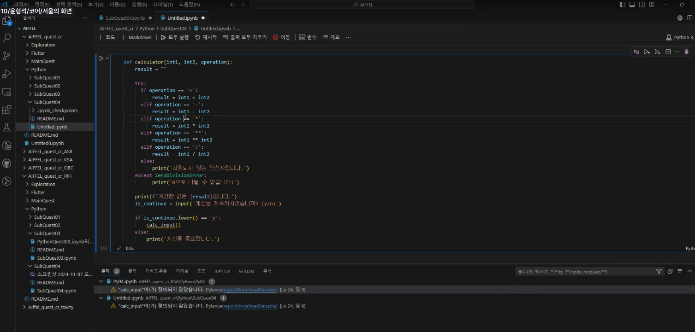

# AIFFEL Campus Online Code Peer Review Templete
코더: 윤형석
리뷰어: 박정현


# PRT(Peer Review Template)
- [x]  **1. 주어진 문제를 해결하는 완성된 코드가 제출되었나요?**
    - 문제에서 요구하는 최종 결과물이 첨부되었는지 확인
       **문제의 요구사항을 충족하는 계산기 기능이 잘 구현되었습니다. 예외 처리를 통해 연산자와 입력값의 오류를 방지하는 코드가 포함되어 있습니다.
        
    
- [x]  **2. 전체 코드에서 가장 핵심적이거나 가장 복잡하고 이해하기 어려운 부분에 작성된 
주석 또는 doc string을 보고 해당 코드가 잘 이해되었나요?**
        **calculator 함수에서 각 연산자에 대해 조건문을 사용하여 구현한 방식이 직관적이라 이해하기 쉬웠습니다.
        다만 연산자마다 기능을 추가하려면 조건문이 늘어날 수 있어, 추후 확장성을 고려한 개선이 필요할 수 있습니다.
        주석이 간결하게 작성되어, 코드가 수행하는 역할을 이해하기 쉬웠습니다.
        
- [x]  **3. 에러가 난 부분을 디버깅하여 문제를 해결한 기록을 남겼거나
새로운 시도 또는 추가 실험을 수행해봤나요?**
       **ZeroDivisionError와 ValueError에 대한 예외 처리가 되어 있어 예상치 못한 입력 오류를 방지하는 점이 인상적입니다. 
        
- [ ]  **4. 회고를 잘 작성했나요?**
       **회고는 포함되지 않았습니다. 코드 작성 시 어려웠던 부분, 개선할 부분,
       또는 추가하고 싶은 기능에 대해 간단히 회고를 남기면 좋을 것 같습니다.
        
- [ ]  **5. 코드가 간결하고 효율적인가요?**
       **코드가 간결하고, 함수별로 역할을 잘 분리하여 가독성이 좋습니다. 그런데 연산자와 기능 확장을 위해, lambda와 dictionary 구조를 활용하여
       중복된 조건문을 줄일 수 있는 방법을 고려해볼 만합니다.


# 회고(참고 링크 및 코드 개선)
```
추후 개선 방향: 중복된 조건문을 lambda와 dictionary를 사용해 간결하게 수정하는 방법을 검토할 수 있습니다.```
